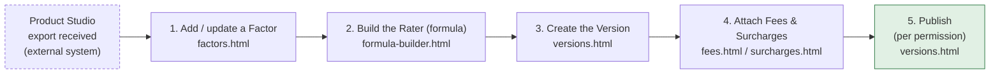
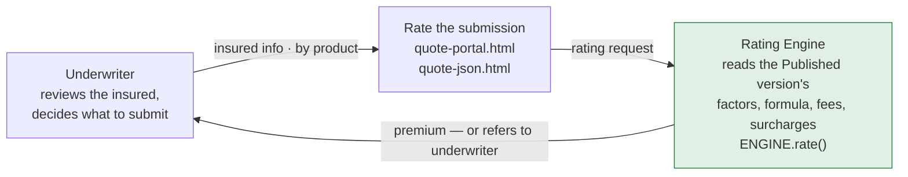

# The rate book lifecycle

How a Product Studio export becomes a published rating version, and how an underwriter's
submission gets rated against it and handed back. Two phases, one artifact passed between
them: the **published version**.

## Phase 1 — build the rate book

Runs once per filing cycle, not per quote. Everything here happens on a `Draft` version —
nothing rates live business until the last step.

| # | Step | Page | What happens |
|---|---|---|---|
| — | Product Studio export received | *(external system)* | Upstream export carries `product_lob` / `coverage_class`. Imported via "Upload Product Configuration". |
| 1 | Add / update a Factor | `factors.html` | A factor value change does not take effect until a **second approver** signs off, and then only from its effective date. |
| 2 | Build the Rater (formula) | `formula-builder.html` | Write a new formula, or reuse an existing one. **Evaluate Formula** tests it before it's trusted. |
| 3 | Create the Version | `versions.html` | Attaches the factors/formulas. Starts as `Draft` — rates nothing yet. |
| 4 | Attach Fees & Surcharges | `fees.html` / `surcharges.html` | Fixed dollar amount or percent of a chosen basis (min/max clamp on percent). Surcharges match in list order — first rule match wins. |
| 5 | Publish | `versions.html` | Gated by access level (**Write** or **Admin**). Publishing automatically retires whichever version was previously live for the same product. |

**Version lifecycle:** `Draft` → `Scheduled` → `Published` → `Expired` → `Archived`

Only one version rates a product at a time. Readiness (every attached formula run through
Evaluate Formula) is checked at publish time; publishing with an untested formula still
attached requires an explicit override.

> The Published version is the only thing Phase 2 reads.

## Phase 2 — rate a submission

Runs once per account, as often as underwriting sends one over. Reads the rate book Phase 1
just built — never edits it.

| Step | Page | What happens |
|---|---|---|
| Underwriter reviews the insured | — | Decides what to submit for rating. |
| Submit insured info | `quote-portal.html` / `quote-json.html` | Info goes in by product; the live Published version for that product is picked automatically. |
| Rating Engine runs | `assets/js/engine.js` (`ENGINE.rate()`) | Reads the Published version's factors, formula, fees and surcharges. |
| Result returns | — | Premium, or a **"refers to underwriter"** flag — back to the **same** underwriter who submitted it. |

**Why it can't drift:** the engine only ever reads whichever version is currently `Published`
for that product — the same Draft → Fees/Surcharges → Publish sequence from Phase 1 is the
only way to change what a submission gets charged. There's no separate "quoting
configuration" to fall out of sync.

## Quick reference — who does each step, and where

| Step | Page | Typically |
|---|---|---|
| Import the Product Studio export | `products.html` | Write |
| Add or edit a rating factor | `factors.html` | Write |
| Approve a factor value change | `factors.html` | Admin |
| Build or reuse a rating formula | `formula-builder.html` | Write |
| Create the draft version | `versions.html` | Write |
| Attach fees & surcharges | `fees.html` · `surcharges.html` | Write |
| Publish the version | `versions.html` | Write / Admin |
| Submit insured info for rating | `quote-portal.html` · `quote-json.html` | Operate |

## Feature details, in flow order

### Rating Factors — `factors.html`

- Three kinds: **Lookup** (selected from a rate table by an insured answer), **Constant**
  (same value on every quote), **Computed** (derived at rating time from several answers).
- Every factor starts "Not wired" regardless of kind until it's approved for Formula Builder
  and its coverage folds it in automatically.
- Editing is dual-control: a value change does not take effect until a **second person
  approves it**, and only from its stated effective date — never immediately, even for the
  person who made the change.

### Formula Builder (the Rater) — `formula-builder.html`

- A token-based formula assembled from approved factors, run through the **same evaluator the
  rating engine itself uses** — so "tested" means tested against what actually rates.
- **Evaluate Formula** runs it against sample inputs before it's trusted. This is exactly what
  a Version's "Readiness" checks for.
- Scope is either **Account level** or a specific **Coverage** — distinct concepts: scope is
  *what it varies by*, not *what it prices*.
- One formula can be attached to several product/version pairs — "use existing one" from the
  flow above means picking an already-built formula off this list rather than writing a new
  one.

### Rating Versions — `versions.html`

- Each version is a complete rating engine for one product: its effective window, rate lock
  date, attached formulas, and exactly which factors were added, changed or removed.
- **Effective date** decides which version rates a transaction — endorsements and renewals use
  whichever version's window contains the transaction date.
- **Rate lock date**: the cut-off before which a quote is honoured at the *prior* version's
  rates for the lock period, even once a new version has gone effective.
- **Readiness**: whether every attached formula has been run through Evaluate Formula.
  Publishing with an untested formula still attached requires an explicit override.
- Bulk-publish is supported, but refuses to publish two versions of the same product in one
  action — only one version may ever be live per product.

### Fees — `fees.html`

- **Fixed** — a dollar amount × charge quantity (per policy, per driver, per vehicle, per
  location). Example: Driver Surcharge $85 × 2 surcharged drivers = $170.
- **Percent** — a rate applied to a chosen basis, then clamped to a min/max if set. Example:
  Broker Fee 8% of Premium Before Fees, min $250 / max $2,500.

### Surcharges — `surcharges.html`

- Premium debits for elevated-risk conditions detected at quote time — the same Fixed/Percent
  shape as fees.
- Matching runs in **list order** over the quote's own LOB plus anything marked "All" — the
  **first match wins**; anything after it is silently skipped. Reordering or deactivating a
  surcharge is how you change which one actually applies — order is itself a rule.

### Publish permissions — `roles.html`

- Two layers: **RBAC** — a role grants actions (can this person publish at all) — and **ABAC**
  — constraints narrow those actions by attribute (this rate table, this state, up to this
  dollar limit). RBAC alone can't express a state/dollar limit; ABAC alone turns every decision
  into a rule hunt, so both run together.
- Access levels: `Admin` · `Write` · `Operate` · `Read` · `External` · `System`. Publishing a
  version needs `Write` or `Admin`.
- Deny is the default — a role has to explicitly grant an action for it to be allowed.

### Quote Sandbox — `quote-portal.html`

- Pick a product, fill in the details, get a premium — each product shows only its own
  questions, not a generic form.
- Carries **Underwriter** and **Underwriter Manager** fields on every quote, so a referred
  account has somewhere to go.
- Runs the exact same `ENGINE.rate()` call the API path below uses — no separate "sandbox
  math" to drift from production rating.

### Quote JSON — `quote-json.html`

- Paste a submission payload, get a rated quote back — exercises the same engine path the
  underwriting service (AMS) uses in production.
- The application-type contract goes in, a rating result comes out. This is the shape an
  external system integrates against, not a UI-only convenience.

---
*VeriDex Rating Platform — internal reference. Traces Products · Rating Factors · Rating
Formulas · Rating Versions · Fees · Surcharges · Quote Sandbox.*
